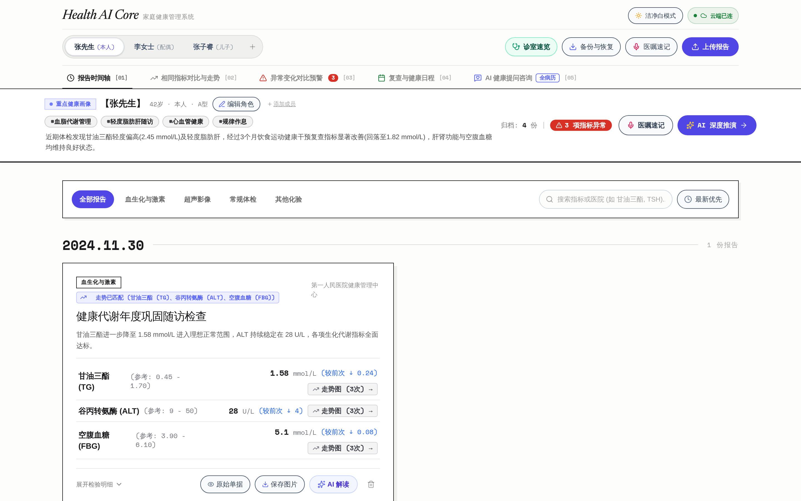
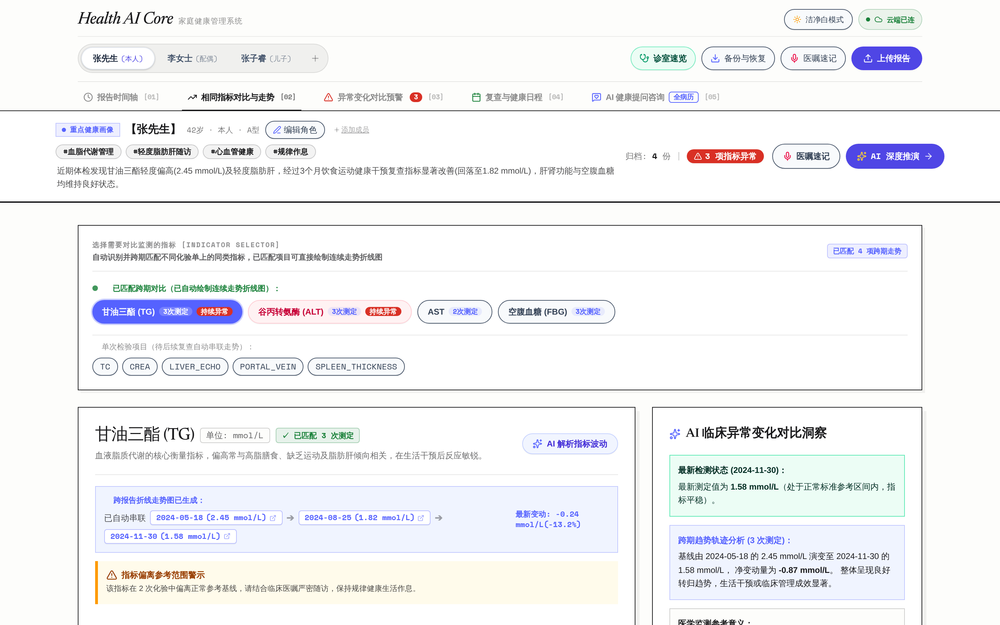
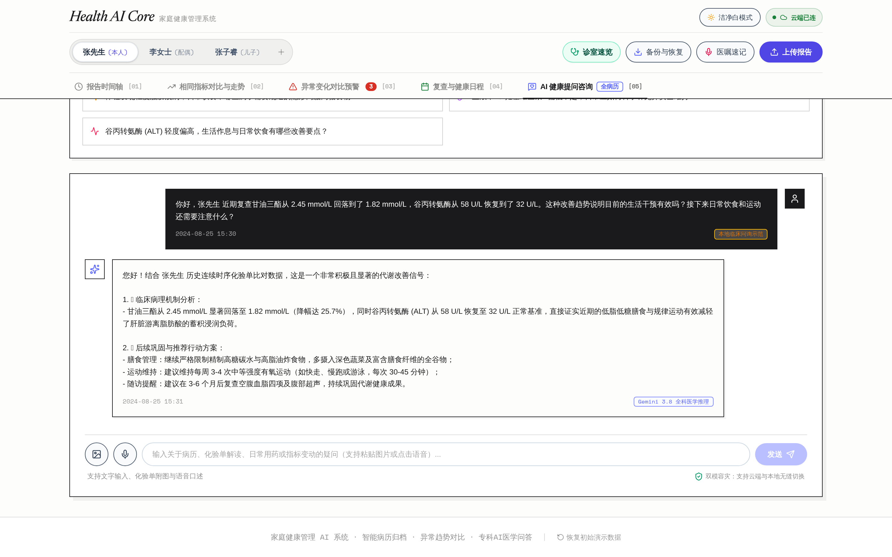
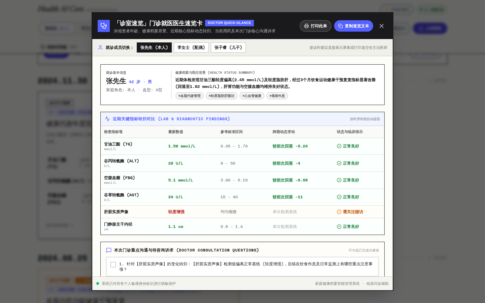
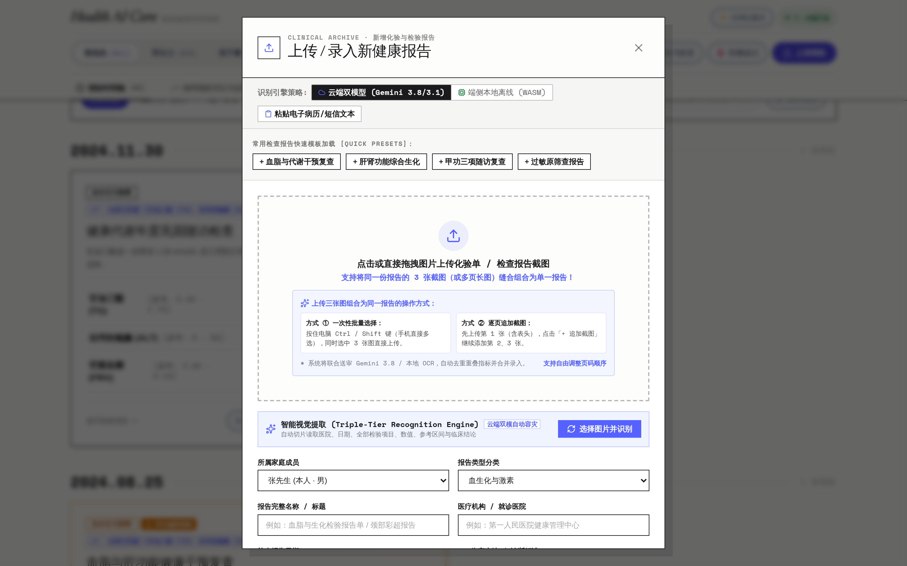
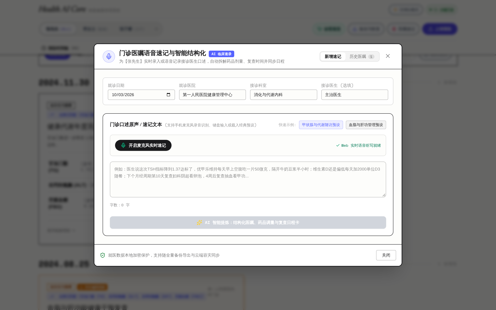
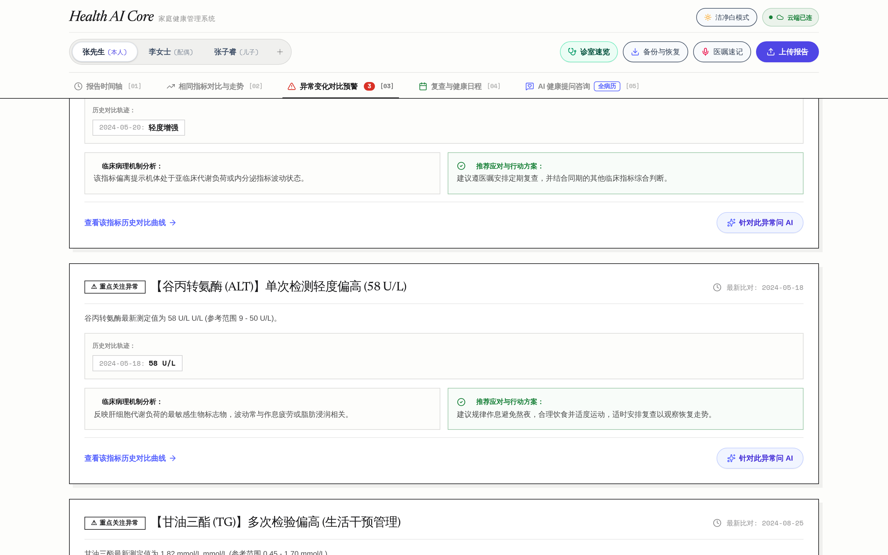
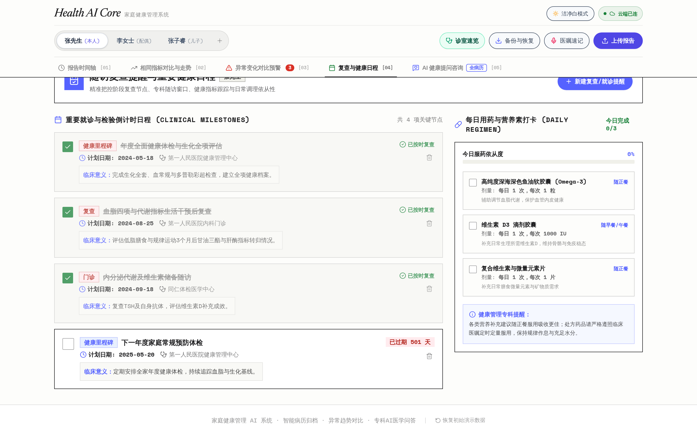

# Release v1.0.0 — FamHealth-AI (家庭健康管理AI系统) 正式版发布

> **Release Tag**: `v1.0.0`  
> **Release Name**: `v1.0.0 - Production Official Release (正式版发布)`  
> **Release Date**: 2026-10-01  

---

## 🚀 版本概述 (Overview)

很高兴宣布 **FamHealth-AI (家庭健康管理AI系统)** 正式发布 **v1.0.0 首个稳定生产版本**！

该版本历经全流程功能验证与系统架构强化，全面打通了从「医疗化验单与体检报告拍照智能提取」、「跨机构跨时序相同指标动态对比」、「就医30秒专家速览卡」、「AI 医生全病史循证咨询」到「中国大陆网络专线中继加速」的完整闭环。

---

## 📸 系统实际界面一览 (Visual Showcase · 全面已脱敏)

<p align="center">
  <picture>
    <source media="(prefers-color-scheme: dark)" srcset="./docs/images/home-dark.png">
    <source media="(prefers-color-scheme: light)" srcset="./docs/images/home-light.png">
    
  </picture>
</p>

| 1. 多成员健康病历时间轴 | 2. 关键指标跨时序波动走势图 |
| :---: | :---: |
|  |  |
| **3. AI 全科医生多模态问诊** | **4. 门诊 30 秒专家速览卡** |
|  |  |
| **5. 多模态化验单 OCR 识别与录入** | **6. 门诊实况录音与医嘱智能纪要** |
|  |  |
| **7. 全家异常指标智能预警中心** | **8. 随访复查日历与健康重要日程** |
|  |  |

---

## 🌟 核心新特性与能力 (Key Highlights)

### 1. 📑 多模态化验单与超声检查 OCR 智能结构化提取
- 集成 Google Gemini 多模态大模型，支持直接上传纸质化验单照片或超声影像单。
- 自动提取所属医院、检查日期、科室、几十项检验指标数值、参考范围与异常警戒分级。
- 支持单据图片自适应压缩渲染（限制在安全尺寸内），防止数据库超限并支持离线保存。

### 2. 📈 跨机构指标时序波动趋势图
- 自动汇聚不同就诊日期的生理指标，绘制高精度走势曲线（促甲状腺激素 TSH、甘油三酯 TG、谷丙转氨酶 ALT、空腹血糖 FBG、维生素D 25-OH-VD）。
- 标注临床警戒线与推荐理想达标区间，历史波动趋势一览无余。

### 3. 🩺 门诊 30 秒专家速览卡与就医问诊备忘录
- 专为三甲门诊高效沟通设计：一屏聚合核心健康概况、当前异常指标红绿灯、调理用药清单与待咨询关键问题。
- 按内科、内分泌科、消化科与慢病门诊分门别类定制就医沟通备忘录。

### 4. 🤖 基于全量历史病历的 AI 全科医生顾问
- 全量融合当前成员的所有化验单据与指标演进作为上下文，告别冷冰冰的通用套话。
- 提供科学健康生活干预方案，并详细说明指标波动的临床意义与生活调理要点。
- 支持多轮诊疗对话与 Markdown / 格式化健康总结导出。

### 5. 🎙️ 就医实况语音录音与智能纪要提炼
- 门诊实况一键录音，AI 自动提炼医嘱核心结论、开单检查与复查节点。

### 6. 📅 健康随访复查与重要日程管理
- 支持建立阶段复查与重要健康节点提醒，协助家庭成员养成规律健康管理习惯。

### 7. ☁️ 中国大陆网络加速专线 + 离线优先双通道架构
- **中国加速专线中继（Server Cloud Tunnel）**：针对国内无法直连 Google Firestore 的网络限制，后端开辟同源中继隧道，实现 100% 免翻墙稳定同步。
- **直连协同与离线优先**：海外与直连环境下自动协同，全站支持离线无网本地缓存。
- **状态栏纯净极简**：顶部状态栏仅展示直观的当前连接状态（`云端已连`、`同步中`、`离线缓存`），点击可展开双通道对齐控制台。

### 8. 📦 全量数据备份与脱敏导出
- 支持一键导出全家病历档案与指标数据为标准 JSON、Markdown 综述以及完整带图 ZIP 压缩包。
- 支持备份数据一键还原，数据自主权完全掌控在用户手中。

---

## 🔒 源码脱敏与安全说明 (Security & Desensitization)

- **全面数据脱敏**：源码仓库及内置示范数据集中的所有真实个人姓名（已全量匿名化为“张先生”、“李女士”、“张子睿”等）、就诊医院（已全量泛化为“第一人民医院健康管理中心”、“同仁体检医学中心”等示范机构）、医生信息与个人标识已全量清除，确保符合开源合规与个人隐私保护标准。
- **敏感凭证隔离**：Git 规则默认忽略 `.env` 及一切本地凭证文件，杜绝 API Key 或个人凭据泄漏。

---

## 📦 依赖环境与升级指南 (Dependencies)

- **Node.js**: `>= 18.0.0` (推荐 `v20.x`)
- **React**: `19.0.1`
- **Tailwind CSS**: `v4.1.14`
- **Google GenAI SDK**: `@google/genai`
- **Firebase Web SDK**: `^12.18.0`

### 安装与运行：
```bash
# 克隆仓库
git clone https://github.com/famhealth-ai/famhealth-ai.git
cd famhealth-ai

# 安装依赖
npm install

# 配置环境变量
cp .env.example .env
# 编辑 .env 填入您的 GEMINI_API_KEY

# 启动开发服务器
npm run dev
```

---

## 🤝 致谢与贡献 (Acknowledgements)

感谢所有参与测试与提供健康管理建议的朋友们！欢迎提出 Issue 和 Pull Request，共同完善家庭健康数字资产管理体系。
